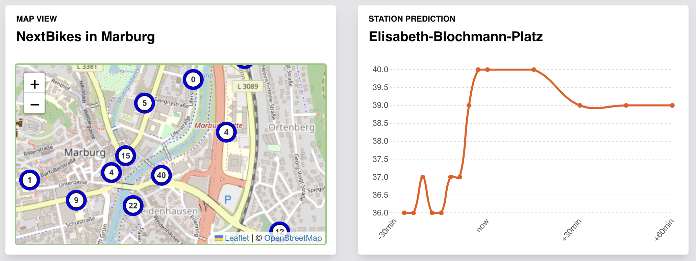
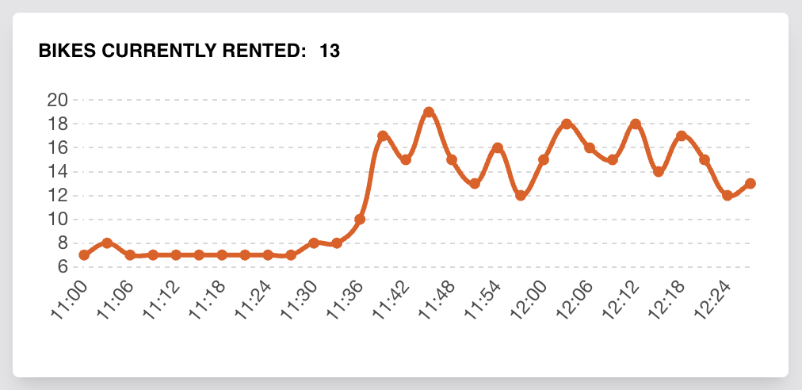
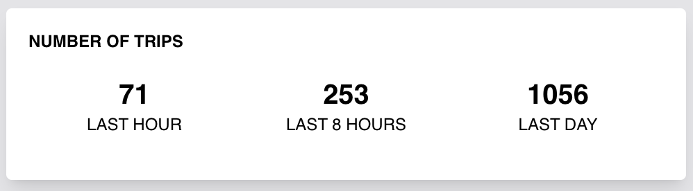
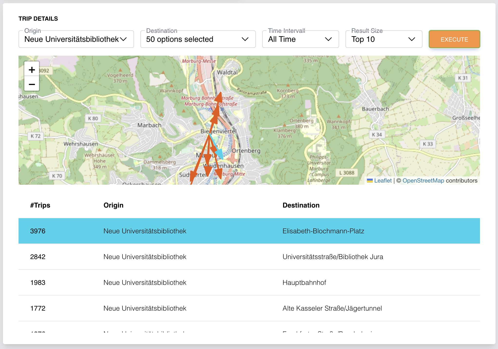

# Bike-MAR-Gration

As part of the lecture "Data Integration" at the University of Marburg, Bela Schinke and Jakob L. Müller launched the (Next)Bike Mar(burg) (inte)gration project.

The product enables a user to view the past activity of a station and getting a prediction of future movement.



Beside the real time predictions the product offers some analytics. A simple graph displays the number of bikes that where rented within the past 90min.



Additionally we display the number of trips within the last hour, last 8 hours and last 24 hours.



Finally we enable a user insights into trips by offering them a way to access the database via a form. Here they can select one or more origins and destinations a time window and target amount to get a visual display of which trips where driven. Further hover events help a user to spot where the trip starts and ends. The screenshot shows an example where `Neue Universitätsbibliothek` was select as the origin and all stations where selected as destinations. The time span was set to the total available time span and lastly the top 10 results were chosen.



The website can be found under [bike-mar-gration.jakob-l-m.de](https://bike-mar-gration.jakob-l-m.de/). If you find bugs or have questions, feel free to contact me.

This document will given an overview over the steps taken, technologies used to reach the shown product.

## Folder Structure

This data integration project has four components: preparation, data integration, data cleaning, and showcase.

- `data/`: This folder explains how we obtained the underlying data. We describe the data pools as well as why and how we use the data.

- `preparation/`: Code to extract and load the datasets into a MySQL Database. Here we also do some selections, transformation and perform basic cleaning

- `integration/`: We perform On-Line integration. The folder includes some of the used queries and information how the different sources are integrated on varying request.

- `prediction-training/`: Experiments to use the integrated dataset to predict bike distribution changes.

- `web-showcase/`: Code to run the interactive web app and use the integration pipeline.

- `presentations/`: Milestone presentations in the context of the course

## Notation

- `time_id`: When we mention a time_id somewhere we always consider this value as the number of seconds since 01.01.1970 (aka a second based timestamp) divided by 180 (3 minutes). We use this notation since scraping is performed every three minutes and we do not need a more precises granularity.

## Documentation
To run the project yourself a few steps are needed. After the project has been cloned, create a `.env` file in `web-showcase/`. The file needs to contain the following parameters:
```conf
MYSQL_HOST = "..."
MYSQL_USER = "..."
MYSQL_PASSWORD = "..."
MYSQL_DATABASE = "..."
SCRAPE_TRIGGER = "..."
WEATHER_KEY = "..."
```
The MYSQL_... parameters are required for the database connection. SCRAPE_TRIGGER should be some UUID that is used to start the scraping process. WEATHER_KEY is the API key for [weather-api.com](TODO). Their free tier allows way more than enough requests for this project.

### Database structure
The mysql database requires the following tables:

1. `bikes`

    **Properties:** 

    | # | name | data typ| nullable | foreign key | comment |
    |---|---|---|---|---|----|
    1 | id | int | NO |  | the bike id as defined by nextBike |
    2 | timeId | int unsigned | NO |  | timeId of the scrape |
    3 | stationId | int | YES | stations(id) | the id of the station if the bike is parked at a station |
    4 | latitude | decimal(16,10) | YES |  | latitude of the bike if the bike is not parked at a station |
    5 | longitude | decimal(16,10) | YES |  | longitude of the bike if the bike is not parked at a station |

    The primary key is (_id_, _time_id_) and _station\_id_ is a foreign key from `stations`. We have build indices over _id_, _time_id_ and _station_id_ for better performance.

    **Usage:** 
    
    The `bikes` table stores the raw information that is scraped. Here _id_ is the bike number. When scraping we add one row for every bike. This is by far the longest table and grows by ~150k entries per day.

2. `stations`

    **Properties:** 

    | # | name | data typ| nullable | foreign key | comment |
    |---|---|---|---|---|----|
    1 | id | int | NO |  | station id as defined by nextBike |
    2 | name | varchar(64) | NO |  | The name of a station as text |
    3 | cityId | int | NO | cities(id) | The id of the city that the station belongs to |
    4 | latitude | decimal(10,6) | NO |  | latitude of the station. |
    5 | longitude | decimal(10,6) | NO |  | longitude of the station |
    6 | firstSeen | int unsigned | NO |  | timeId first occurrence in a scrape |
    7 | lastSeen | int unsigned | NO |  | timeId last occurrence in a scrape |

    **Usage:** 
    
    The `station` table stores information about the station positions as well as the first and last `time_id` of a stations appearance. Here _id_ is the station number. When scraping we update the _first_seen_ and _last_seen_ columns.

3. `trips`

    **Properties:** 
    | # | name | data typ| nullable | foreign key | comment |
    |---|---|---|---|---|----|
    | 1 | bikeId | int | NO |  bikes(id) | id of the bike |
    | 2 | startTime | int | NO |  | first timeId where the bike was seen at the stationId during that trip |
    | 3 | endTime | int | NO |  | last timeId where the bike was seen at the stationId during that trip |
    | 4 | stationId | int | YES | stations(id) | stationId that the bike stood at |
    | 5 | latitude | decimal(10,6) | YES |  | latitude if bike is not at a station |
    | 6 | longitude | decimal(10,6) | YES |  | longitude if bike is not at a station |
    | 7 | nextStationId | int | YES | stations(id) | stationId of the next station, NULL if next station is not a station |
    | 8 | nextStartTime | int | YES |  | startTime of the next station defining a trip if this is not NULL | 

    Additionally we construct B-Trees over the primary key(bikeId, startTime) as well as stationId and nextStationId to improve query performance

    **Usage:** 
    
    The `trips` table stores information about the trips of all bikes. We define a trip through a bikeId and a startTime. Every trip can be ongoing if nextStartTime is NULL or complete if a nextStartTime exists. Trips are automatically updated during scraping.

4. `cities`

    **Properties:** 
    | # | name | data typ| nullable | foreign key | comment |
    |---|---|---|---|---|----|
    1 | id | int | NO |  | unique id for every city. Eg auto increment |
    2 | name | varchar(64) | NO |  | the cities name |
    3 | latitude | decimal(16,8) | NO |  | latitude of the city. Used for weather scraping |
    4 | longitude | decimal(16,8) | NO |  | longitude of the city. Used for weather scraping |

    **Usage:** 
    
    The `cities` table stores information about the cites that are scraped. This opens the possible of multi-city analysis. For now we only considered a single cite (Marburg).

5. `weather`

    **Properties:** 

    | # | name | data typ| nullable | foreign key | comment |
    |---|---|---|---|---|----|
    1 | timeId | int | NO |  | timeId of scrape |
    2 | cityId | int | NO | cities(id) | cityId that was scraped |
    3 | temp | decimal(8,4) | NO |  | temperature in degrees Celsius |
    4 | feelsLikeTemp | decimal(8,4) | NO |  | felt temperature in degrees Celsius |
    5 | isDay | tinyint(1) | NO |  | boolean indicator if it was day (between sunrise and sunset) at the time of scraping |
    6 | description | varchar(64) | NO |  | The weather condition as a string. Eg cloudy, clear, overcast, ... |
    7 | cloud | int | NO |  | Value from 0 to 100 indicating cloud intensity |
    8 | wind | decimal(8,4) | NO |  | wind speed in kilometers per hour |
    9 | gust | decimal(8,4) | NO |  | gust speed in kilometers per hour |

    The primary key is (timeId, cityId).

    **Usage:** 
    
    The `weather` table stores the relevant subset of the weather scrape.

6. `events`

    **Properties:** 
    
    | # | name | data typ| nullable | foreign key | comment |
    |---|---|---|---|---|----|
    1 | date | date | NO |  | Date of the event |
    2 | name | varchar(64) | NO |  | Name of the event |
    3 | value | int | YES |  | Optional value of the event |
    4 | description | varchar(128) | YES |  | Optional additional text |
    5 | group | int | YES |  | Group Id if event fits into a group | 

    **Usage:** 
    
    The `event` table stores information about events grouped into categories like public holidays or local events.


### Running the dev version locally
First init node.js
```
cd web-showcase
npm install
```
Then start the tailwind watcher and node server
```
npx tailwindcss -i ./input.css -o ./assets/css/tw.css --watch
```
```
npm run dev
```
This will start a server listening on localhost:3000 which auto updates/restarts on changes

### Using the trained model in production
We use the tensorflowjs python library to converted the trained model for web usage. See the [official tutorial](https://www.tensorflow.org/js/tutorials/conversion/import_saved_model). For us, a clean python 3.11.4 was used

Command for conversion, execute in a shell an root level
```
tensorflowjs_converter ./prediction-training/models/MODEL-NAME ./web-showcase/assets/model --input_format=tf_saved_model --output_node_names=web-model
```